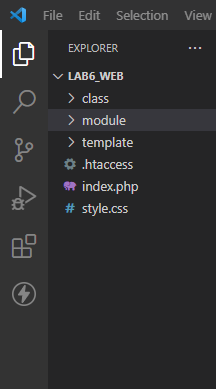
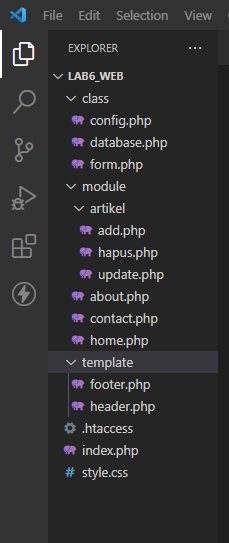
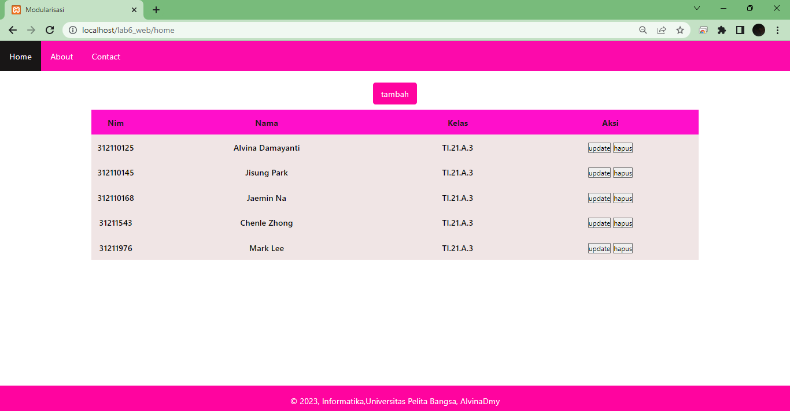
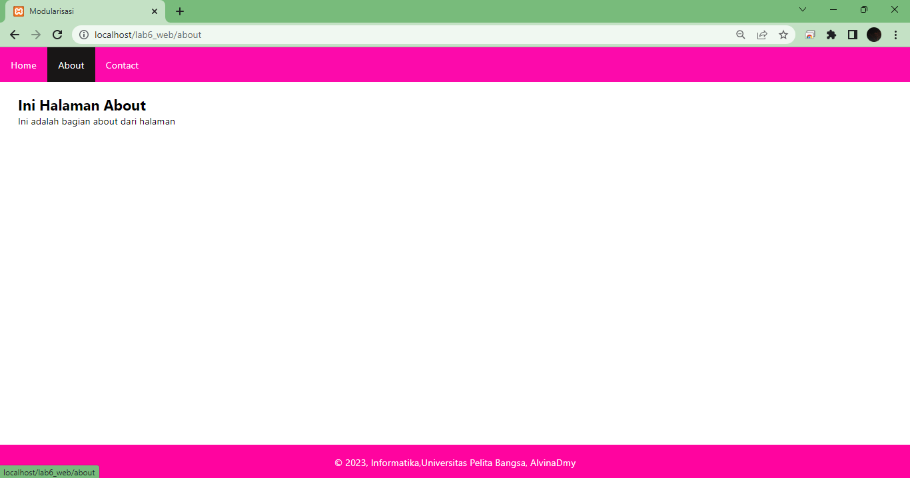
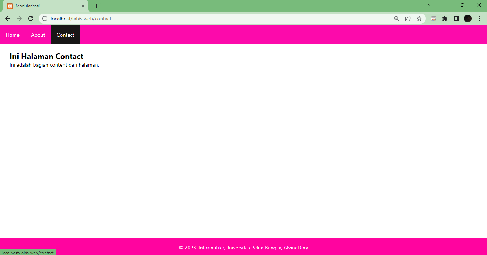
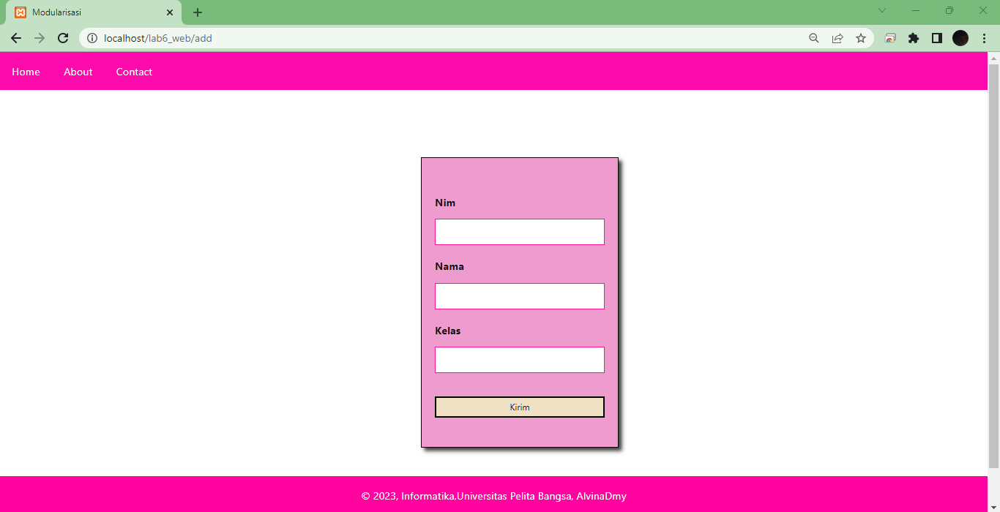

## PHP OOP LANJUTAN

Nama: Alvina Damayanti

Nim: 312110125

Kelas: TI.21.A.3

## Buat project baru dengan struktur sebagai berikut:

1. Copy file library (class) dari praktikum 5 dan letakkan pada folder class.
2. Buat file template yang berisi template dan css untuk header, footer dan menu sidebar.
dan menu sidebar.
3. Buat modul artikel yang berisi CRUD dengan memanfaatkan library database dan form tersbut.
4. File index.php berisi proses routing aplikasi dan dikombinasikan dengan penggunaan mod_rewrite pada file .htaccess

## OUTPUT

## Tampilan home

## Tampilan about

## Tampilan contact

## Tampilan tambah data

